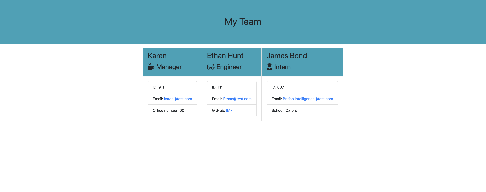

# Team Generator 
A Command Line Interface application that allows user to build a custom engineering team. 

## Description
The application is built using Node.Js and Javascript. Besides Node.js, the concepts of Object oriented programming was also used while building this project. The application can be run using 'node app.js' command on the terminal. Once the application runs, user will be asked with a series of questions on how they would like to build  team. Once all the questions are answered, all the user input will be displayed in a HTML file(as displayed in screensht below).

## Screenshot

- - -

